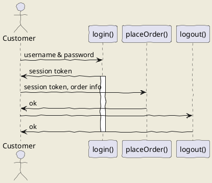

# 361_Microservice
Code for CS 361 Microservice

README clearly describes how to request data from the microservice you implemented

README has UML sequence diagram that clearly communicates how to request and receive data from the microservice you implemented; No obvious notational errors

## uml: sequence diagram
Here I will embed PlantUML markup to generate a sequence diagram.

I can include as many plantuml segments as I want in my Markdown, and the diagrams can be of any type supported by PlantUML.

